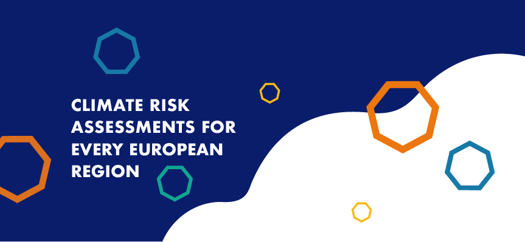
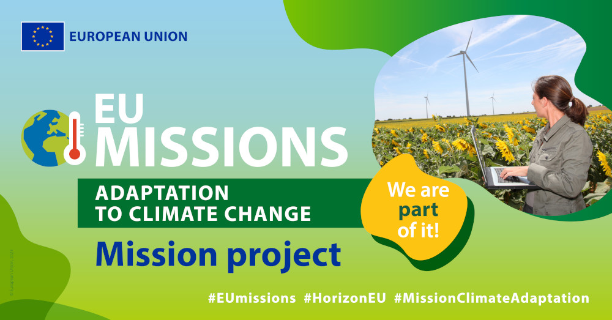

# The CLIMAAX project

CLIMAte risk and vulnerability Assessment framework and toolboX (CLIMAAX) is a 4-year Horizon Europe project that provides financial, analytical, and practical support to improve regional climate and emergency risk management plans.
[CLIMAAX](https://www.climaax.eu/) is designed to contribute to the harmonization and consolidation of the practice of climate risk assessment, leaving a legacy for upcoming European initiatives.
The project started in January 2023 and runs until December 2026.

## In a nutshell

The European landscape of disaster risk management and climate adaptation is far from uniform.

CLIMAAX builds upon existing risk assessment frameworks, methods and tools, and promotes the use of datasets and service platforms for local and regional scale deployment. It develops a robust and coordinated framework of consistent, harmonised and comparable risk assessments.

The project takes the existing tools and services beyond the state-of-the-art by prioritizing the further development of accessibility, guidance, tuning to local contexts, interpretation and uptake by representative disaster risk management and civil protection authorities.

CLIMAAX is designed to significantly contribute to the harmonization and consolidation of the practice of climate risk assessment (CRA) by providing:

1. A standardized {abbr}`CRA (Climate Risk Assessment)` framework built on current community experience and best-practices.
2. A toolbox for conducting risk analyses, which hosts data, models and utilities and provides access to European and global open data archives integrated with local data and procedures.
3. Five European pilot regional {abbr}`CRA (Climate Risk Assessment)`s to shape the framework and toolset.
4. Financial support for at least 50 regions to execute a context specific {abbr}`CRA (Climate Risk Assessment)`.
5. {abbr}`CRA (Climate Risk Assessment)` guidance material and online helpdesk for other European regions.
6. A proposal to upscale results into the future operationalization of the regional {abbr}`CRA (Climate Risk Assessment)` support function.

## EU Mission on Adaptation to Climate Change

Climate change affects regions, sectors of the economy and members of society in many ways, and EU regions and cities have different climate vulnerabilities and levels of preparedness.
Adapting to climate change means taking action to prepare for and adjust to both the current effects of climate change and the predicted impacts of the future.

The [EU Mission on Adaptation to Climate Change](https://research-and-innovation.ec.europa.eu/funding/funding-opportunities/funding-programmes-and-open-calls/horizon-europe/eu-missions-horizon-europe/adaptation-climate-change_en#what-are-the-eu-missions) empowers European regions and local authorities to achieve climate resilience, aiming to guide at least 150 communities through understanding climate risks, developing pathways for preparation, and implementing innovative solutions by 2030.

## Acknowledgements

This project has received funding from the European Union's Horizon Europe – the Framework Programme for Research and Innovation (2021-2027) under grant agreement No. 101093864.
